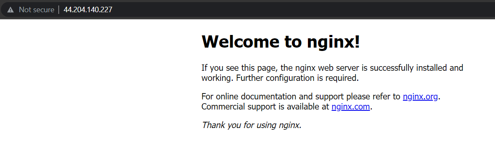
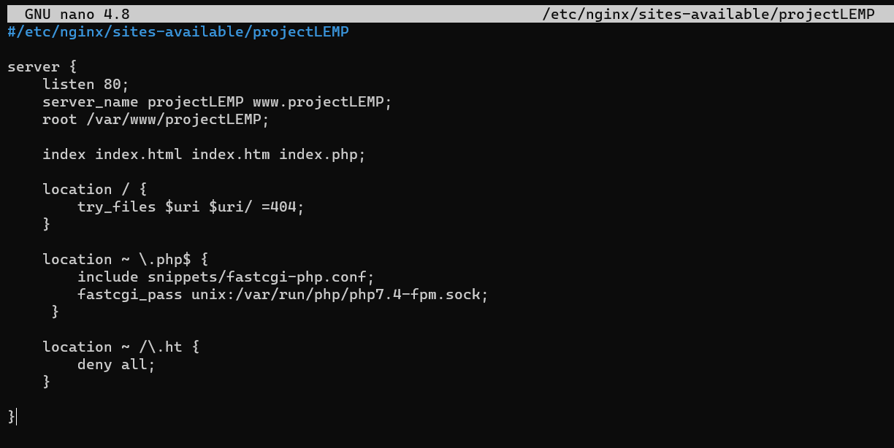
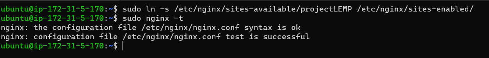
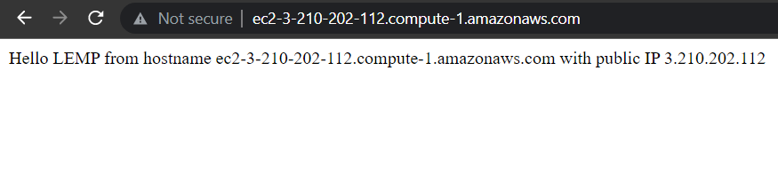

# **PROJECT 2: LEMP STACK IMPLEMENTATION**

___
### **TASK 1: INSTALLING THE NGINX WEB SERVER**
___

I ran the following commands on my virtual machine to update a list of packages in the Ubuntu package manager, to install ngnix and to verify that it is running as a service in my OS:

`sudo apt update`

`sudo apt install ngnix`

`sudo systemctl status ngnix`

The outcome is depicted in the image below:

A new rule was then added to the EC2 configuration to open inbound connection through port 80, shown below:

Next, I checked that my Nginx server can be accessed locally in my virtual machine. The result is displayed below:

---
### **TASK 2: INSTALLING MYSQL**
___

MySQL software was installed on my OS by running the following command:

`sudo apt install mysql-server`

The outcome is shown below

This step was immediately followed by running the secruity script. This was done with the command below, to which I responded with any other key besides 'Y':

`sudo mysql_secure_installation`

This step was immediately followed by running the secruity script. This was done with the command below, to which I responded with any other key besides 'Y':

`sudo mysql_secure_installation`

Thereafter, I logged in to the MySQL console by running this command:

`sudo mysql`

The outcome is shown below:

___
### **TASK 3: INSTALLING PHP**
___

I ran the command below to simultaneously install phb-fpm and php-mysql:

`sudo apt install php-fpm php-mysql`

Thereafter, the command below was used to check my PHP version:

`php -v`

The details of the insatlled PHP is displayed below:

___
### **TASK 4 — CONFIGURING NGINX TO USE PHP PROCESSOR**
___

The following were the commands run:

`sudo mkdir /var/www/projectLEMP`

I then assigned ownership of the directory to my user using the command

`  sudo chown -R $USER:$USER /var/www/projectLEMP`

Then, I created and opened, using Nano, a new configuration file in Nginx’s sites-available directory. I named it projectLEMP.conf. Thereafrer, I pasted the following text in the opened file:

Next, I activated the configuration by linking to the config file from Nginx’s sites-enabled directory:

`sudo ln -s /etc/nginx/sites-available/projectLEMP /etc/nginx/sites-enabled/`

The configuration was tested for syntax error with `sudo nginx -t`  and it was error free. This is shown below:

I ran the following command to complete my configuration:

`sudo unlink /etc/nginx/sites-enabled/default`
`sudo systemctl reload nginx`

I created an index.html file in the web root using this command:

`sudo echo 'Hello LEMP from hostname' $(curl -s http://169.254.169.254/latest/meta-data/public-hostname) 'with public IP' $(curl -s http://169.254.169.254/latest/meta-data/public-ipv4) > /var/www/projectLEMP/index.html`

From from browser, I opened my website URL and the result returned is shown below:

